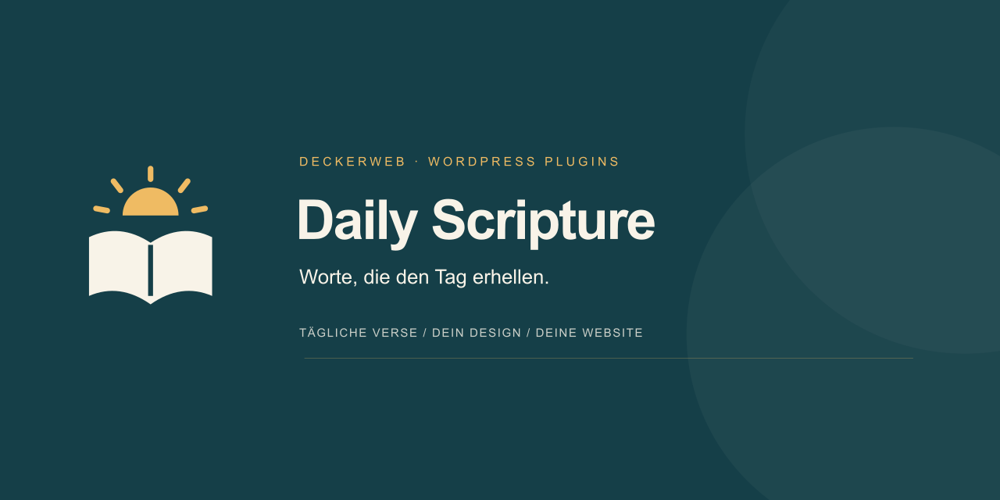
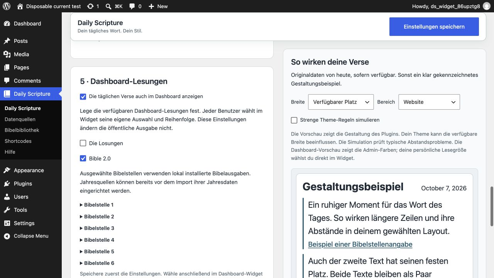

# Daily Scripture

## Kurzvorstellung

**Worte, die den Tag erhellen.** Die Losungen, „Das Wort für heute“ von Bible 2.0 und selbst gewählte Bibelstellen: Daily Scripture bringt tägliche Lesungen auf deine WordPress-Website. Wähle ein Layout, passe die Schrift an und prüfe die Vorschau. Die Texte liegen lokal, die Gestaltung passt zu dir.

Daily Scripture ergänzt deine WordPress-Website um tägliche Lesungen, ausgewählte Bibelstellen und persönliche Dashboard-Widgets. Wähle deine Quellen, gestalte die Ausgabe und zeige Lesungen mit Gutenberg, Shortcodes, Elementor oder Bricks an. Die Website-Funktionen sind auch in Multisite nutzbar, ergänzt um eine Leseansicht im Network Admin.

**Version:** 1.0.0 · **Voraussetzungen:** WordPress 6.6+ / PHP 8.0+ · **Lizenz:** GPL-2.0-or-later

[Download](https://github.com/deckerweb/daily-scripture/releases/latest) · [Anleitung](https://github.com/deckerweb/daily-scripture/wiki/Deutsch) · [English](README.md)

## Inhaltsverzeichnis

- [Auf einen Blick](#auf-einen-blick)
- [Installation und erste Verse](#installation-und-erste-verse)
- [Tagesverse und Bibelbibliothek](#tagesverse-und-bibelbibliothek)
- [Layouts und Schriftgrößen](#layouts-und-schriftgroessen)
- [Editoren, Shortcodes und Dashboard](#editoren-shortcodes-und-dashboard)
- [Daten und Einstellungstransfer](#daten-und-einstellungstransfer)
- [Updates und Dokumentation](#updates-und-dokumentation)
- [Häufige Fragen](#haeufige-fragen)
- [Changelog](#changelog)
- [Autor und Projekt](#autor-und-projekt)

## Auf einen Blick

- **Jeden Tag ein Wort:** offizielle Verspaare der Losungen und von Bible 2.0, als Jahrespaket herunterladen oder manuell hochladen.
- **Eigene Bibelstellen auswählen:** eine unabhängige lokale Bibliothek mit Luther 1912, Elberfelder 1905, Menge 1939 und Schlachter 1951.
- **Passend zu deiner Website:** zehn Layouts, helle und dunkle Ansichten, kompakte Abstände, eigene Farben und eine Vorschau in mehreren Breiten.
- **Ausgewogen lesen:** eine gemeinsame Schriftgrößen-Skala, bei Bedarf ergänzt um Expertenwerte in px, em, rem, %, oder CSS-Variablen.
- **Im vertrauten Editor arbeiten:** Gutenberg-Blöcke, Elementor-Widgets und Bricks-Elemente für Tagesverse und eigene Bibelstellen; zwei Shortcodes funktionieren ohne Builder.
- **Ein kleiner Begleiter im Alltag:** Dashboard-Widget mit persönlichen Schriftgrößen und Abständen, eigenen Quellenüberschriften und der WordPress-Adminfarbe.
- **Für weitere Projekte vorbereitet:** geprüfter JSON-Einstellungstransfer, lokale Textspeicherung und Updates über das reguläre WordPress-Updatesystem.

## Installation und erste Verse

1. Lade das **Plugin-ZIP** aus den [GitHub-Releases](https://github.com/deckerweb/daily-scripture/releases/latest).
2. Installiere es über **Plugins → Plugin hinzufügen → Plugin hochladen** und aktiviere es.
3. Öffne **Daily Scripture → Datenquellen**, prüfe die Verfügbarkeit und importiere ein offizielles Jahrespaket. Alternativ kannst du es manuell hochladen.
4. Wähle unter **Gestaltung** ein Layout, passe die Gesamtgröße an und prüfe die Vorschau. Speichere mit dem Button oben.
5. Füge den Block, das Builder-Element oder den Shortcode **Daily Scripture** ein. Für eigene Bibelstellen installierst du vorher eine Ausgabe unter **Bibelbibliothek**.

Vorausgesetzt werden WordPress 6.6+, PHP 8.0+ und DOM/XML. ZIP-Pakete benötigen ZipArchive. Elementor und Bricks sind optional. Der Pluginname bleibt auch auf Deutsch **Daily Scripture**.

## Tagesverse und Bibelbibliothek

Tagesverse und selbst gewählte Bibelstellen sind getrennte Ausgaben. Das offizielle Losungen-Paar bleibt zusammen und unverändert; die Wahl einer lokalen Bibelausgabe schreibt diese Texte nicht um. Bible 2.0 verwendet die Texte und Hinweise des importierten Jahrespakets.

In der unabhängigen Bibelbibliothek wählst du Übersetzung, Buch, Kapitel und bis zu 50 Verse innerhalb eines Kapitels. Die Volltexte werden separat installiert. Luther 1912, Elberfelder 1905 und Menge 1939 verwenden die geprüften gemeinfreien Quellen; die verwendete Schlachter-1951-Quelle steht unter **CC BY 4.0**. Quellen- und Lizenzhinweise bleiben zugänglich.

Bibleserver wird nur für Bibelstellen-Links verwendet. Die separat gewählte Zielübersetzung verändert das Linkziel, nicht den auf deiner Website angezeigten Text.

## Layouts und Schriftgrößen

Beginne mit einem Layout und dem Regler für die Gesamtgröße: Überschrift, Vers, Bibelstelle, Datum und Quellenhinweise bleiben im Verhältnis zueinander. Wähle normale oder kompakte Abstände und anschließend helle, dunkle, geräteabhängige oder eigene Farben. Der Expertenmodus ergänzt individuelle Schriftgrößen und Farben.

Vorhandene CSS-Variablen wie `var(--text-xxl, 28px)` sind möglich. Gib einen Ersatzwert an: Die abgeschirmte Adminvorschau kann die Variablen deines Themes oder Builders nicht einlesen. Prüfe breite und schmale Ansichten und danach die veröffentlichte Seite. Der Vers steht im Mittelpunkt, mit klarer Überschrift und dezenteren Bibelstellen- und Lizenzangaben.

## Editoren, Shortcodes und Dashboard

Gutenberg zeigt die Einstellungen in der Seitenleiste und eine serverseitig erzeugte Vorschau im Block. Blöcke können die gespeicherten Vorgaben übernehmen oder eigene Überschriften und Darstellungsoptionen verwenden. Elementor und Bricks bieten zusätzlich native Regler für Schriften, Farben, Rahmen und Abstände sowie responsive Werte.

`[daily_scripture]` gibt Tagesverse aus, `[daily_scripture_passage]` eine selbst gewählte Bibelstelle. Auf der Pluginseite **Shortcodes** findest du Beispiele mit Kopierbuttons und alle Buchkürzel.

Im Dashboard kann jeder Benutzer über **Ansicht anpassen** kompakte Abstände und eine Versgröße von 14, 16 oder 18 px wählen. Das gilt nur für diesen Benutzer auf dieser Website. Quellenüberschriften und das Standard-Datumsformat folgen den Website-Einstellungen.

## Daten und Einstellungstransfer

Du startest die Jahresdownloads selbst. Die Quellenprüfung zeigt verfügbare Pakete, installiert aber nicht automatisch das Folgejahr. Der Import prüft vollständige Jahre und Verspaare vor dem Ersetzen lokaler Daten. Installiere das nächste Jahr rechtzeitig und aktualisiere Seiten- oder CDN-Caches zum Tageswechsel.

Alle verwalteten Textdateien bleiben unter `wp-content/uploads/daily-scripture/`. JSON-Exporte enthalten die gespeicherte Gestaltung oder Website-Einstellungen, aber keine Bibeltexte, Jahrespakete, persönlichen Dashboard-Werte oder Builder-Stile. Importierte Einstellungen erscheinen zunächst zur Prüfung im Formular und gelten nach dem Speichern. Nimm die Textdateien in dein normales Website-Backup auf.

## Updates und Dokumentation

Updates kommen direkt aus dem [DECKERWEB-Repository auf GitHub](https://github.com/deckerweb/daily-scripture/releases) und erscheinen bei aktivem Daily Scripture im **regulären WordPress-Updatesystem**. Aktualisiere wie gewohnt über Plugins oder Dashboard → Aktualisierungen; ein zusätzliches Updater-Plugin ist nicht nötig. Automatische Updates bleiben deine Entscheidung.

Die [deutsche Anleitung](https://github.com/deckerweb/daily-scripture/wiki/Deutsch), die [englische Anleitung](https://github.com/deckerweb/daily-scripture/wiki/English) und die thematischen FAQs erklären Einstellungen, Quellen und häufige Fragen. Eine [lokale Kopie](docs/Deutsch.md) liegt im Plugin. Im Admin-Footer findest du die Dokumentation und den Changelog-Dialog. Zwischengespeicherte Updateprüfungen können ein neues Angebot bis zu 30 Minuten verzögern; ein manuelles ZIP-Update ist ebenfalls möglich.

## Häufige Fragen

**Brauche ich Elementor oder Bricks?** Nein. Gutenberg, Shortcodes und das Dashboard-Widget funktionieren unabhängig von beiden Buildern.

**Sind Bibeltexte im Download enthalten?** Nein. Jahrespakete und Bibelausgaben installierst du separat im Plugin. Beachte die Bedingungen der jeweiligen Quelle.

**Kann ich den offiziellen Losungstext durch eine andere Übersetzung ersetzen?** Nein. Das offizielle Paar bleibt zusammen und unverändert. Für eigene Auswahltexte verwendest du die separate Bibelstellen-Ausgabe.

**Wird das nächste Jahr automatisch installiert?** Nein. Prüfe unter Datenquellen die Verfügbarkeit und starte den Import vor dem Jahreswechsel selbst.

**Verändert ein JSON-Import sofort die Website?** Nein. Prüfe ihn im Formular und speichere zum Anwenden. JSON enthält Einstellungen, keine gespeicherten Bibeltexte.

**Warum erscheinen noch die Verse von gestern?** Prüfe die WordPress-Zeitzone, die installierten Jahresdaten und Seiten-/CDN-Caches. Zwischengespeicherte Seiten müssen zum Tageswechsel aktualisiert werden.

**Wie funktionieren Updates?** Der enthaltene deckerweb-Updater liefert öffentliche GitHub-Releases über die regulären WordPress-Updates. Ein zusätzliches Updater-Plugin ist nicht nötig.

[Alle Fragen nach Themen](https://github.com/deckerweb/daily-scripture/wiki/FAQ-Deutsch)

### Netzwerk-Dashboard und Seiten-Caches

## Changelog

### 1.0.0

- **Neu:** Persönliche Widget-Quellenwahl, mehrere Lesungen und anpassbare Reihenfolge für WordPress-Websites, auch in Multisite; eigene Bibelstellen und wählbare Bezugswebsite im Network Admin.
- **Verbessert:** Moderner WordPress-Farbwähler im Modal, übersichtliche Dashboard-Einstellungen und besser lesbare Widget-Abstände.
- **Behoben:** Strengere Paketprüfung bei Sammelupdates und getrennte Datenbereinigung in Multisite; Einstellungen bleiben standardmäßig erhalten.
- **Sonstiges:** Englische Oberfläche sowie deutsche Du-/Sie-Fassungen; aktualisierte Dokumentation und lokale Updategrafiken.

### 0.17.0

Unveröffentlichte Zwischenversion; in Version 1.0.0 enthalten.

- **Neu:** Rein lesende Website-Zustand-Prüfung für Jahresdaten und ein kompakter Diagnosebericht.

### 0.16.4

- **Neu:** Zeigt lokale Icons und sprachabhängige Banner in den WordPress-Updateangeboten und Versionsdetails.

### 0.16.2

- **Verbessert:** Zweisprachige Anleitungen, thematische FAQ und direkt erreichbare Dokumentation in allen Plugin-Adminseiten.

### 0.16.1
- **Sonstiges:** GPL-2.0-or-later für den Plugin-Code ausdrücklich dokumentiert; vollständige Lizenzdatei und Veröffentlichungspaket ergänzt. Die Nutzungsbedingungen der Bibeltexte bleiben unabhängig davon.

### 0.16.0
- **Neu:** Gemeinsame deckerweb GitHub Release Updater-Bibliothek wie in Brand Admin Schemes, mit WordPress-Updateanzeige und Release-Details.
- **Verbessert:** Begrenzte HTTPS-Metadatenabfragen, zwischengespeicherte Ergebnisse und lokalisierte Updatefehler.
- **Verbessert:** Prüfung von Paketidentität, angebotener Version und tatsächlichen WordPress-/PHP-Anforderungen vor dem Austausch der Plugin-Dateien.
- **Sonstiges:** Update-URI, Bibliotheksherkunft und Anleitung für öffentliche GitHub-Releases dokumentiert; automatische Updates bleiben eine Benutzerentscheidung.

### 0.15.0
- **Neu:** Changelog-Dialog neben der Versionsnummer auf allen Plugin-Adminseiten, mit deutscher oder englischer Versionshistorie.
- **Verbessert:** Englische Standard-Readmes und separate deutsche Fassungen; Verweise passend zur jeweiligen Sprache.

### 0.14.0
- **Neu:** Deutsche Sprachdateien für Plugin und Block-Editor.
- **Verbessert:** Kürzere Plugin-Beschreibung mit dem aktuellen Funktionsumfang; verständlichere Hilfen und einheitliche deutsche Begriffe.
- **Verbessert:** Readme als aktuelle Anleitung mit Einrichtung, Gestaltung, Shortcodes, Datenpflege und allen vier Bibelausgaben.
- **Behoben:** Veraltete Speicherpfade und unvollständige Hinweise zu Datenlöschung, JSON-Export und Dashboard-Vorschau berichtigt.
- **Sonstiges:** Vollständige Versionshistorie mit den Präfixen New, Improved, Fixed und Misc; Übersetzungsvorlage aktualisiert. Der Pluginname bleibt Daily Scripture.

[Vollständiger Änderungsverlauf im Wiki](https://github.com/deckerweb/daily-scripture/wiki/Changelog-Deutsch) · [Lokale Historie](docs/Changelog-Deutsch.md) · [Releases](https://github.com/deckerweb/daily-scripture/releases)

## Autor und Projekt

Entwickelt von **David Decker – DECKERWEB**, damit tägliche Bibelverse auf Gemeinde-, Kunden- und persönlichen Websites gut lesbar ihren Platz finden.

Eine Idee oder einen Fehler gefunden? [Melde dich auf GitHub](https://github.com/deckerweb/daily-scripture/issues). Nenne Plugin-, WordPress- und PHP-Version sowie den betroffenen Editor und die Schritte zum Nachstellen.

Vertrauliche Sicherheitsmeldungen: [Sicherheitsmeldeweg](SECURITY-de.md). Unterstützung: [Ko-fi](https://ko-fi.com/deckerweb), [Buy Me a Coffee](https://buymeacoffee.com/daveshine), [PayPal](https://paypal.me/deckerweb).

Der Plugin-Code steht unter **GPL-2.0-or-later**. Für Bibeltexte und Jahrespakete gelten eigene Bedingungen. © 2026 David Decker – DECKERWEB · [Lizenz](LICENSE)

Gemeinsame Komponenten: deckerweb Library 0.6.0 und Updater 2.1.0, David Decker – DECKERWEB, GPL-2.0-or-later. Herkunft und Verhalten: [Komponenten](UPDATER-de.md).

## Dashboard-Lesungen und Farbwähler

Lege unter **Daily Scripture → Dashboard-Lesungen** die angebotenen Lesungen fest: Die Losungen, Bible 2.0 und bis zu sechs Bibelstellen aus lokal installierten Ausgaben (bis zu 50 Verse innerhalb eines Kapitels). Speichere die Website-Einstellungen und öffne im Widget **Ansicht anpassen**. Wähle eine oder mehrere Lesungen und ändere ihre Reihenfolge mit **Nach oben / Nach unten**. Ohne JavaScript stehen Positionsfelder bereit. Ohne eingerichtete Lesungen erscheint ein zurückhaltender Hinweis; fehlende Jahresdaten oder Bibelausgaben werden je Lesung angezeigt. Persönliche Auswahl und Reihenfolge ändern die öffentliche Ausgabe nicht. Vollständige JSON-Sicherungen enthalten die Lesungsdefinitionen; reine Designs und ältere Sicherungen lassen sie unverändert. Installiere benötigte Ausgaben auf der Zielwebsite, bevor du importierte Bibelstellen speicherst.

Das Network-Admin-Widget verwendet eine persönlich gewählte aktive Website des aktuellen Netzwerks und nennt diese sichtbar. Ist nur die Hauptwebsite aktiv, wird sie automatisch verwendet. Bei mehreren aktiven Websites oder Netzwerkaktivierung kannst du die Bezugswebsite wählen: Speichere nach dem Wechsel einmal, um deren Lesungen zu laden, und triff danach deine persönliche Auswahl. Ist die bisherige Website nicht mehr verfügbar, folgt ein Hinweis und eine Ersatzwebsite. Das Widget steht im Network Admin bei Aktivierung auf der Hauptwebsite oder im Netzwerk bereit; eine ausschließliche Unterwebsite-Aktivierung lädt es dort nicht. Der Website-Widget-Schalter betrifft das Dashboard dieser Website; die Netzwerk-Leseansicht ist unabhängig. Die Website-Auswahl wird in Gruppen von 50 angeboten. Es entsteht keine zusätzliche Netzwerk-Bibeltextdatenhaltung.

Farben wählst du über den modernen WordPress-Farbwähler in einem WordPress-Modal; direkte Hex-Eingabe und geerbte Textfarben bleiben möglich. Änderungen werden erst mit dem Speichern der Einstellungen wirksam.

Die korrigierte deckerweb-Katalogfreigabe bleibt Voraussetzung für allgemeine Netzwerkaktivierung. Seiten-/CDN-Caches sollten nach Mitternacht in der Website-Zeitzone erneuert werden.

## Einstellungen im Überblick

Dashboard-Quellen und eine klar gekennzeichnete Gestaltungsvorschau auf einer WordPress-Website.
