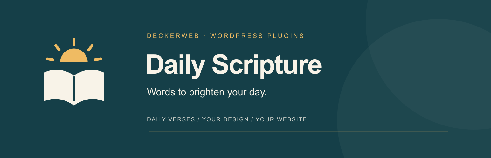

# Daily Scripture

**Words to brighten your day.** Die Losungen, “The Word for Today” from Bible 2.0 and your own passage selections: Daily Scripture brings daily readings to your WordPress website. Choose a layout, adjust the type and check the preview. Texts stay local; the design fits your site.

**Version:** 0.16.2 · **Requires:** WordPress 6.6+ / PHP 8.0+ · **License:** GPL-2.0-or-later

[Download](https://github.com/deckerweb/daily-scripture/releases/latest) · [User guide](https://github.com/deckerweb/daily-scripture/wiki/English) · [Deutsch](README-de.md)

## Contents

- [At a glance](#at-a-glance)
- [Installation and first verses](#installation-and-first-verses)
- [Daily readings and Bible library](#daily-readings-and-bible-library)
- [Layouts and typography](#layouts-and-typography)
- [Editors, shortcodes and dashboard](#editors-shortcodes-and-dashboard)
- [Data and settings transfer](#data-and-settings-transfer)
- [Updates and documentation](#updates-and-documentation)
- [FAQ](#faq)
- [Changelog](#changelog)
- [About](#about)

## At a glance

- **A daily reading, ready to display:** official verse pairs from Die Losungen and Bible 2.0, downloaded as annual packages or uploaded manually.
- **Your own passage selections:** a separate local library with Luther 1912, Elberfelder 1905, Menge 1939 and Schlachter 1951.
- **A design that fits:** ten layouts, light and dark appearances, compact spacing, custom colors and a live preview at several widths.
- **Balanced, readable type:** one overall scale, plus optional expert sizes in px, em, rem, %, or CSS variables.
- **At home in your editor:** Gutenberg blocks, Elementor widgets and Bricks elements for both daily readings and selected passages; two shortcodes work without a builder.
- **A small daily companion:** a dashboard widget with personal size and spacing choices, source headings and the WordPress admin accent.
- **Ready for another project:** validated JSON settings transfer, local text storage and updates in the regular WordPress update system.

## Installation and first verses

1. Download the **plugin ZIP** from [GitHub Releases](https://github.com/deckerweb/daily-scripture/releases/latest).
2. Install it through **Plugins → Add Plugin → Upload Plugin** and activate it.
3. Open **Daily Scripture → Datenquellen** (data sources), check availability and import an official annual package. Manual upload is available too.
4. Under **Gestaltung** (design), choose a layout, adjust the overall size and check the preview. Save with the button at the top.
5. Add the **Daily Scripture** block, builder element or shortcode. For selected passages, install an edition under **Bibelbibliothek** first.

WordPress 6.6+, PHP 8.0+ and DOM/XML are required. ZIP packages need ZipArchive. Elementor and Bricks are optional. The current admin interface is primarily German; this guide includes its actual menu labels.

## Daily readings and Bible library

Daily readings and your own passage selections are separate. The official Losungen pair stays together and unchanged; changing the local Bible edition does not rewrite it. Bible 2.0 uses the texts and notices supplied in its annual package.

The independent Bible library lets you select a translation, book, chapter and up to 50 verses within one chapter. Full texts are installed separately. Luther 1912, Elberfelder 1905 and Menge 1939 use the reviewed public-domain sources; the supplied Schlachter 1951 source is **CC BY 4.0**. Source and license notices remain accessible.

Bibleserver is used for reference links only. Its independently selected target translation changes the link destination, not the text displayed on your site.

## Layouts and typography

Start with a layout and the overall size slider: heading, verse, reference, date and source notices stay in proportion. Choose standard or compact spacing, then light, dark, device-based or custom colors. Expert mode adds individual sizes and colors when you need them.

Existing CSS variables such as `var(--text-xxl, 28px)` are supported. Include a fallback: the isolated admin preview cannot read your theme or builder variables. Preview wide and narrow screens, then check the published page in your actual theme. Keep the verse central, with a clear heading and quieter reference and license text.

## Editors, shortcodes and dashboard

Gutenberg keeps controls in the sidebar and shows a server-rendered preview. Blocks can inherit saved defaults or use their own titles and display options. Elementor and Bricks also offer native typography, color, border and spacing controls, including responsive settings.

Use `[daily_scripture]` for daily readings and `[daily_scripture_passage]` for a selected passage. The plugin’s **Shortcodes** page provides examples with copy buttons and all book codes.

Each dashboard user can choose compact spacing and a 14, 16 or 18 px verse size under **Ansicht anpassen**. These preferences affect only that user on that site. Source headings and the default date format come from the site settings.

## Data and settings transfer

Annual downloads are started by you. The source check shows available packages; it does not install the next year automatically. Import validates complete years and verse pairs before replacing local data. Install next year’s package in advance and refresh page or CDN caches at the daily changeover.

All managed text files stay under `wp-content/uploads/daily-scripture/`. JSON exports contain saved design or site settings, not Bible texts, annual packages, personal dashboard choices or builder styles. Imported settings appear in the form for review and apply only when saved. Include local text files in your normal website backup.

## Updates and documentation

Updates come directly from the [DECKERWEB repository on GitHub](https://github.com/deckerweb/daily-scripture/releases) and appear in the **regular WordPress plugin update system** while Daily Scripture is active. Update through Plugins or Dashboard → Updates as usual; no additional updater plugin is needed. Automatic updates remain your choice.

The [English guide](https://github.com/deckerweb/daily-scripture/wiki/English), [German guide](https://github.com/deckerweb/daily-scripture/wiki/Deutsch) and themed FAQs explain settings, sources and common problems. A [local copy](docs/English.md) is included in the plugin. The admin footer links to the documentation and opens the changelog in a dialog. Cached update checks can delay a new offer by up to 30 minutes; a manual ZIP update is also available.

## FAQ

**Do I need Elementor or Bricks?** No. Gutenberg, shortcodes and the dashboard widget work independently of either builder.

**Are Bible texts included in the download?** No. Install annual packages and Bible editions separately in the plugin. Observe the terms of each source.

**Can I replace the official Losungen text with another translation?** No. The official pair stays together and unchanged. Use the separate passage output for your own selections.

**Is next year installed automatically?** No. Check availability under Data sources and start the import yourself before the year changes.

**Does a JSON import immediately change the website?** No. Review it in the form and save to apply it. JSON contains settings, not stored Bible texts.

**Why are yesterday’s verses still showing?** Check the WordPress timezone, installed annual data and page/CDN caches. Cached pages need to refresh at the daily changeover.

**How do updates work?** The bundled deckerweb updater delivers public GitHub releases through regular WordPress updates. No additional updater plugin is required.

[More answers by topic](https://github.com/deckerweb/daily-scripture/wiki/FAQ-English)

## Changelog

### 0.16.2

- **Improved:** Rebuilds all four readmes around a clear feature overview, linked contents, seven quick answers and the latest five versions.
- **Improved:** Adds English and German GitHub banners, detailed bilingual guides, themed FAQs and the complete release history.
- **Improved:** Links the documentation from every plugin admin footer and explains updates through the regular WordPress update system.
- **Misc:** Packages the documentation locally and keeps the shared deckerweb updater unchanged.

### 0.16.1
- **Misc:** Explicit GPL-2.0-or-later licensing for the plugin code, with the full license and publication package. Bible text permissions remain separate.

### 0.16.0
- **New:** Shared deckerweb GitHub Release Updater library, as used by Brand Admin Schemes, with WordPress update notices and release details.
- **Improved:** Bounded HTTPS metadata requests, cached results and localized update errors.
- **Improved:** Package identity, offered version and actual WordPress/PHP requirements checked before replacing plugin files.
- **Misc:** Update URI, library provenance and public GitHub release instructions documented; automatic updates remain a user choice.

### 0.15.0
- **New:** Changelog dialog beside the version number on every plugin admin page, with German or English release history.
- **Improved:** English default readmes and separate German editions, with language-matched documentation links.

### 0.14.0
- **New:** German translation files for the plugin and block editor.
- **Improved:** Concise plugin description covering current features, clearer help and consistent German terminology.
- **Improved:** Current readme covering setup, design, shortcodes, data management and all four Bible editions.
- **Fixed:** Outdated storage paths and incomplete notes on data removal, JSON exports and dashboard previews.
- **Misc:** Complete release history using New, Improved, Fixed and Misc prefixes; refreshed translation template. The plugin name remains Daily Scripture.

[Full changelog in the wiki](https://github.com/deckerweb/daily-scripture/wiki/Changelog-English) · [Local history](docs/Changelog-English.md) · [Releases](https://github.com/deckerweb/daily-scripture/releases)

## About

Built by **David Decker – DECKERWEB** to give daily Bible readings a readable place on church, client and personal websites.

Have an idea or found a problem? [Open an issue](https://github.com/deckerweb/daily-scripture/issues) with plugin, WordPress and PHP versions, the affected editor and steps to reproduce it.

Plugin code is licensed under **GPL-2.0-or-later**. Bible texts and annual packages have separate terms. © 2026 David Decker – DECKERWEB · [License](LICENSE)
