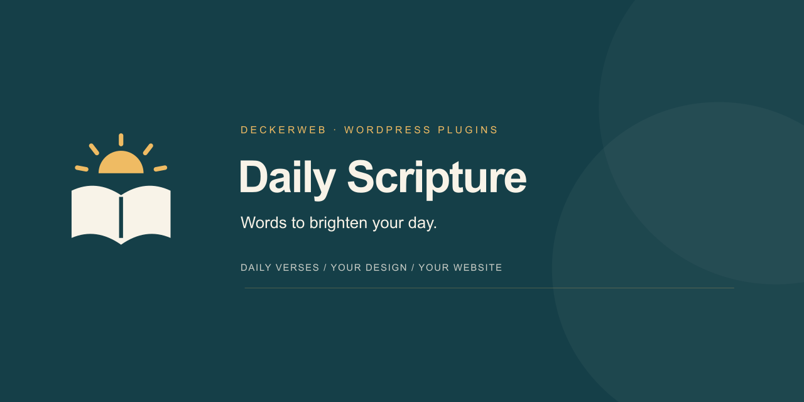

# Daily Scripture · Documentation / Dokumentation

**Words to brighten your day. · Worte, die den Tag erhellen.**

Daily Scripture adds daily readings, selected Bible passages and personal dashboard widgets to your WordPress website. Choose your sources, shape the design and display readings with Gutenberg, shortcodes, Elementor or Bricks. Website features also work in Multisite, with an additional Network Admin reading view.

Choose a language for setup, daily readings, Bible passages, design, editors, backups and updates.

Daily Scripture ergänzt deine WordPress-Website um tägliche Lesungen, ausgewählte Bibelstellen und persönliche Dashboard-Widgets. Wähle deine Quellen, gestalte die Ausgabe und zeige Lesungen mit Gutenberg, Shortcodes, Elementor oder Bricks an. Die Website-Funktionen sind auch in Multisite nutzbar, ergänzt um eine Leseansicht im Network Admin.

Wähle deine Sprache für Einrichtung, Tagesverse, Bibelstellen, Gestaltung, Editoren, Sicherungen und Updates.

| English | Deutsch |
| --- | --- |
| [User guide](English.md) | [Anleitung](Deutsch.md) |
| [Answers by topic](FAQ-English.md) | [Antworten nach Themen](FAQ-Deutsch.md) |
| [Complete changelog](Changelog-English.md) | [Vollständiger Änderungsverlauf](Changelog-Deutsch.md) |

[Download / Releases](https://github.com/deckerweb/daily-scripture/releases/latest) · [Questions / Fragen](https://github.com/deckerweb/daily-scripture/issues)

© 2026 David Decker – DECKERWEB · GPL-2.0-or-later
